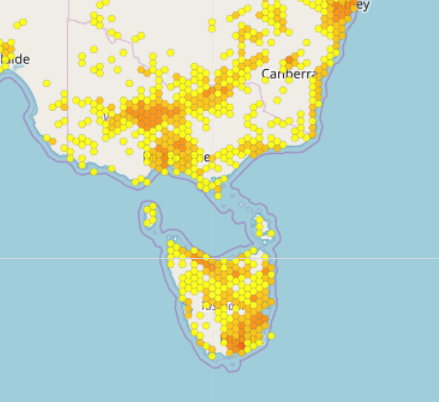

```{r setup, include=FALSE}
knitr::opts_chunk$set(echo = T)
```
## Interactive maps in R with leaflet

```{r echo = F}
library(leaflet)
leaflet() %>% 
  addTiles() %>% setView(151.2313, -33.9173, zoom = 16)
```

## Interactive vs static

<div class="columns-2">

### Interactive

  - nice supplementary materials!
  -  supervisors
  - label points without clutter!
  - websites, blogs
  - shiny apps


### Static

  - publications
  - .pdf, .word files
  - not too many points
  - not too close together (labling)
  - still __really__ useful
  
</div>

## Leaflet {#leaflet_intro}

<div class="columns-2">
  - JavaScript mapping library
  - Nice R api, developed by rstudio [docs](https://rstudio.github.io/leaflet/ )
  - 23k github stars!
  - open source
  - similar to google maps
  - Leaflet is __not the tiles__
  


```{r, echo = F}
leaflet(width = 300, height = 300) %>% addTiles()
```

</div>
  
## Basic usage {.smaller}


```{r}
# install.packages('leaflet') #    install package
library(leaflet)              #    load package
leaflet(height = 300) %>%     # 1. create map widget
  addTiles()                  # 2. add layers
```

- note: leaflet uses the `%>%` not ` + `
- `height` argument just for presentation

## Controlling bounds

```{r}
leaflet(height = 400) %>% 
  addTiles() %>% 
  setView(151.2313, -33.9173, zoom = 16) # UNSW!
```

## Scale Bars

```{r}
leaflet(height = 400) %>% 
  addTiles() %>% 
  addScaleBar() ## EASY!
```

## Minimaps

```{r}
leaflet(height = 400) %>% 
  addTiles() %>% 
  addMiniMap(zoomLevelFixed = 4) ## EASY!
```

## Both!

We are going to save this map as a base layer for later use

```{r}
base <- leaflet(height = 400) %>% 
  addTiles() %>%
  addScaleBar() %>%
  addMiniMap(zoomLevelFixed = 4)
base
```

## Markers

- [marker docs](https://rstudio.github.io/leaflet/markers.html)

```{r}
base %>% 
  addMarkers(151.2313, -33.9173, label = 'UNSW!') %>% 
  addCircleMarkers(151.233, -33.9173, radius = 30, opacity = 0.4, popup = 'UNSW', color = 'red')
```

## eBird Example

My eBird data

```{r}
library(dplyr, warn.conflicts = F)
obs <- read.csv('MyEBirdData.csv') %>% group_by(Latitude, Longitude) %>% 
  summarise(total_species = n_distinct(Common.Name),
            my_label = paste(total_species, 'species seen'))

obs %>% glimpse()
```

---

```{r}
base %>% 
  addCircleMarkers(obs$Longitude, obs$Latitude, label = obs$my_label)
```


## Clustering

```{r}
base %>% 
  addCircleMarkers(obs$Longitude, obs$Latitude,
                   label = obs$my_label,
                   clusterOptions = markerClusterOptions())
```

## Colouring markers

<!-- - [colouring docs](https://rstudio.github.io/leaflet/colors.html) -->

```{r}
pal <- colorNumeric("viridis", obs$total_species) # color function, maps values to colors
base %>% 
  addCircleMarkers(obs$Longitude, obs$Latitude, color = pal(obs$total_species),
                   label = obs$my_label)
```

## Legends

[legend docs](https://rstudio.github.io/leaflet/legends.html)

```{r}
base %>% 
  addCircleMarkers(obs$Longitude, obs$Latitude, color = pal(obs$total_species),
                   label = paste(obs$total_species, 'species')) %>% 
  addLegend(pal = pal, values =  obs$total_species, position = "bottomleft")
```

## Shapes, Polygons, Geojson

```{r}
randwick <- readLines('https://raw.githubusercontent.com/coreytcallaghan/urban_greenspaces/master/greenspaces/aus-nsw-randwick_environment_park/aus-nsw-randwick_environment_park.geojson', warn = F)
base %>% 
  addCircles(151.25, -33.93,  radius = 100, color = 'red') %>% 
  addRectangles(151.24, -33.93 - 0.01,151.25 + 0.01,  -33.93 + 0.01, color = 'green') %>% 
  addGeoJSON(randwick, color = 'teal')
```

## GBIF basemaps

- Look for a species using the search on https://www.gbif.org/
- find one that youre interested in e.g. Swift Parrot `https://www.gbif.org/species/2480052` <- note the id in the url
- [GBIF map api docs](https://www.gbif.org/developer/maps)

```{r}
gbif_map_url <- function (id) paste0(
    'https://api.gbif.org/v2/map/occurrence/density/{z}/{x}/{y}',
    '@2x.png?style=classic.poly&bin=hex&taxonKey=',
    id,
    '&srs=EPSG:3857')
```



---

```{r}
base %>% 
  setView(151.25, -33.93, zoom = 7) %>% 
  addTiles(urlTemplate = gbif_map_url(2480052))
```

## Base layers 

- Open Street map tile servers (https://wiki.openstreetmap.org/wiki/Tile_servers)
- `addProviderTiles(providers$Stamen.Toner)`

```{r}
leaflet(height=350) %>% 
  addProviderTiles(providers$Stamen.Toner) %>% 
  setView(151.2313, -33.9173, zoom = 16)
```

## More base layers

- cartodb layers [link](https://github.com/CartoDB/basemap-styles)
- some base layers need attribution

```{r}
leaflet(height = 350) %>% 
  addTiles( "http://{s}.basemaps.cartocdn.com/rastertiles/voyager/{z}/{x}/{y}.png",
    attribution = paste("&copy; <a href=\"http://openstreetmap.org\">OpenStreetMap</a> contributors","&copy; <a href=\"http://cartodb.com/attributions\">CartoDB</a>")
) %>% setView(151.2313, -33.9173, zoom = 16)
```

## Carto with GBIF


```{r}
leaflet(height = 350) %>% 
  addTiles( "http://{s}.basemaps.cartocdn.com/dark_nolabels/{z}/{x}/{y}.png",
    attribution = paste("&copy; <a href=\"http://openstreetmap.org\">OpenStreetMap</a> contributors","&copy; <a href=\"http://cartodb.com/attributions\">CartoDB</a>")
) %>%
  addTiles(urlTemplate = gbif_map_url(2480052)) %>% 
  setView(151.2313, -33.9173, zoom = 8)
```

## Questions

- slides at https://twitter.com/johnhwilshire